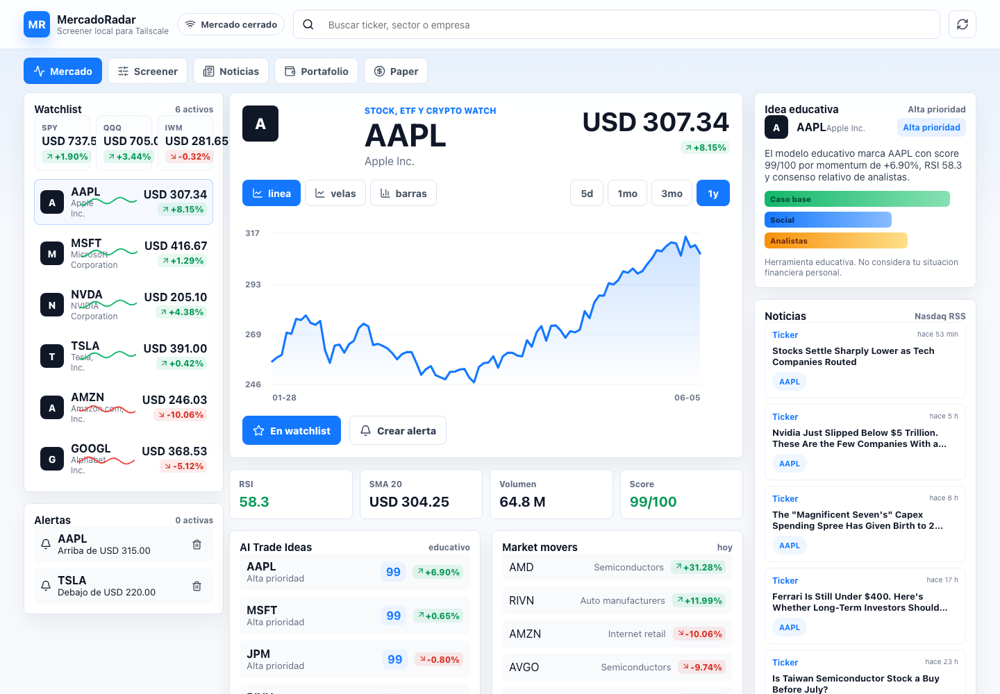
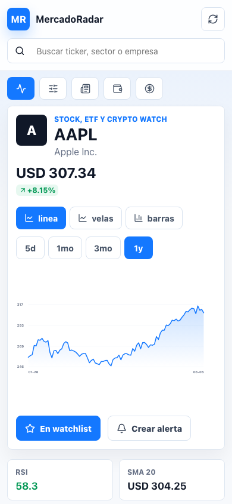

# MercadoRadar

MercadoRadar es un _workbench_ financiero local que reúne exploración de mercado, señales explicables, seguimiento de cartera y práctica de decisiones en una sola interfaz. Está construido para demostrar un producto de datos de extremo a extremo: ingesta con degradación controlada, análisis reproducible, persistencia local y una experiencia React adaptable a escritorio y móvil.

> Las señales, puntuaciones y narrativas son educativas. No constituyen asesoría financiera ni una recomendación de inversión.

## Vista del producto

| Escritorio | Móvil |
| --- | --- |
|  |  |

Las capturas contienen únicamente símbolos bursátiles y datos de mercado públicos o de demostración; no incluyen cuentas, posiciones ni identificadores personales.

## Qué resuelve

- Consolida watchlist, alertas, noticias, históricos y un screener técnico/fundamental.
- Produce señales con evidencia, nivel de confianza, riesgos y trazabilidad de la fuente.
- Degrada a fuentes gratuitas o datos demo cuando un proveedor no está disponible, marcando el resultado que no es apto para decisión.
- Importa una cartera por CSV, mantiene un diario de decisiones y ofrece paper trading en el navegador.
- Permite comparar proveedores de mercado de EE. UU. y BMV sin acoplar la UI a uno solo.

## Arquitectura

```text
React 19 + TypeScript + Vite
        │ API same-origin
        ▼
Express 5 ── proveedores (Polygon, Twelve Data, Alpha Vantage,
    │         Stooq, Yahoo y fallback demo)
    ▼
SQLite local (cache, señales, cartera, decisiones y configuración)
```

El estado de paper trading, alertas y watchlist vive en `localStorage`. El servidor crea y migra automáticamente una base limpia en `data/mercadoradar.sqlite`; ese directorio es estado de ejecución y está excluido de Git.

## Inicio rápido

Requisitos: Node.js 24 y npm.

```bash
git clone <URL_DEL_REPOSITORIO>
cd mercadoradar
npm ci
npm run dev
```

Abre `http://127.0.0.1:5174`. Vite reenvía `/api` al servidor local en `127.0.0.1:8787`.

Para ejecutar el build de producción:

```bash
npm run build
MERCADORADAR_PORT=8797 npm run serve
```

La aplicación queda disponible en `http://127.0.0.1:8797`.

## Datos demo y datos en vivo

No se necesita una API key para explorar el producto: Stooq, Yahoo y el generador demo funcionan como fallbacks. Las fuentes externas pueden aplicar límites, cambiar su disponibilidad o entregar datos retrasados; MercadoRadar muestra la procedencia y bloquea señales de decisión cuando la calidad no alcanza el umbral requerido.

Para proveedores autenticados, define las credenciales en el entorno del proceso. Esta es la opción recomendada porque tiene prioridad sobre cualquier valor local:

```bash
export POLYGON_API_KEY='<TU_API_KEY>'
export TWELVEDATA_API_KEY='<TU_API_KEY>'
export ALPHAVANTAGE_API_KEY='<TU_API_KEY>'
export DEEPSEEK_API_KEY='<TU_API_KEY>'
export DEEPSEEK_MODEL='deepseek-v4-pro'
npm run serve
```

También puedes usar:

| Variable | Propósito | Valor por defecto |
| --- | --- | --- |
| `MERCADORADAR_DB_PATH` | Ruta de la SQLite local | `./data/mercadoradar.sqlite` |
| `MERCADORADAR_LIVE` | Usa `false` para forzar datos demo en el dashboard principal | `true` |
| `MERCADORADAR_PORT` | Puerto del servidor | `8787` |
| `MERCADORADAR_HOST` | Interfaz de escucha | `127.0.0.1` |
| `MERCADORADAR_ALLOWED_ORIGINS` | Orígenes web exactos, separados por coma | Orígenes loopback de API y Vite |

La pantalla de configuración puede guardar claves en SQLite para desarrollo local. Esos valores no se devuelven al navegador, pero quedan almacenados sin cifrar: usa variables de entorno para un entorno serio y nunca versiones `data/`.

## Seguridad y acceso remoto

El servidor y Vite escuchan únicamente en loopback de forma predeterminada. CORS acepta una lista exacta de orígenes, cualquier `Origin` no listado se rechaza y las mutaciones requieren una cabecera no simple para reducir el riesgo de CSRF.

Si necesitas acceso remoto, mantén `MERCADORADAR_HOST=127.0.0.1` y publica la aplicación detrás de un proxy con TLS y autenticación. Configura el origen público explícitamente, por ejemplo:

```bash
MERCADORADAR_ALLOWED_ORIGINS='https://radar.example.internal' \
MERCADORADAR_PORT=8797 \
npm run serve
```

El proxy debe autenticar cada solicitud y reenviarla a `http://127.0.0.1:8797`. Una VPN o red privada reduce exposición, pero no sustituye autenticación. No enlaces el proceso a `0.0.0.0` ni abras el puerto directamente a Internet. Consulta [SECURITY.md](SECURITY.md) para el modelo operativo y el canal de reporte.

## Calidad

```bash
npm run lint
npm test
npm run build
```

La suite cubre el motor de señales, importación de cartera, bootstrap/migración de SQLite y controles de Origin, CORS y CSRF. GitHub Actions ejecuta estas validaciones en cada push y pull request.

## Estructura del proyecto

```text
src/                 interfaz React, configuración y cliente API
server/              API Express, proveedores, señales y persistencia
tests/               pruebas unitarias y de seguridad HTTP
output/playwright/   capturas de referencia del producto
scripts/             launchers locales portables para macOS
```

## Limitaciones conocidas

- No es una plataforma de ejecución de órdenes ni consulta cuentas de brokerage.
- Los proveedores gratuitos pueden ser incompletos, retrasados o limitar solicitudes.
- El scoring y el backtest son herramientas exploratorias; no modelan comisiones, deslizamiento, impuestos ni la situación del usuario.
- SQLite y `localStorage` son apropiados para uso individual, no para un despliegue multiusuario.
- La aplicación no implementa autenticación propia; cualquier publicación remota requiere un proxy autenticado.
